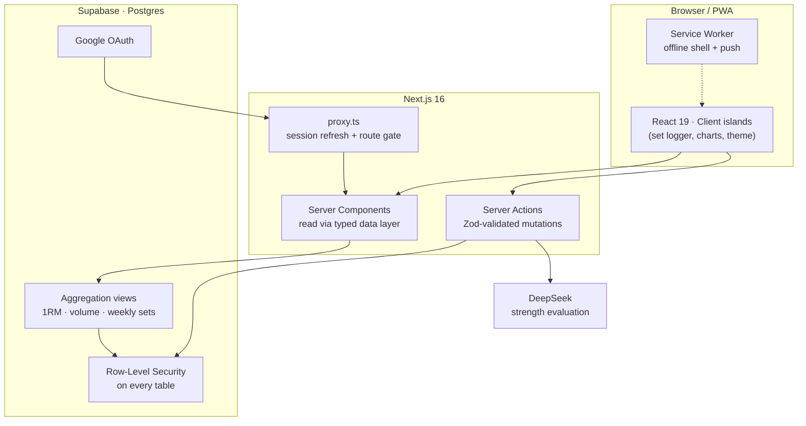

<div align="center">

# 🔥 HELL BLAZER

### Train like a Kengan fighter.

A production-grade, **Kengan Ashura-themed** strength tracker built around a savage-fast mobile set logger and a live analytics engine. Log every set like it counts, then earn your place on the ladder of monsters.

<br />

[](https://hellblazer.vercel.app)
[](https://nextjs.org)
[](https://react.dev)
[](https://www.typescriptlang.org)
[](https://supabase.com)
[](https://tailwindcss.com)

**[Live app →](https://hellblazer.vercel.app)** · App by [Cyrus](https://kkrwhofrags.xyz)

</div>

---

Hell Blazer is a real, multi-user workout app, not a demo. Every screen runs against live Postgres data behind row-level security, sign-in is Google-only, and the whole thing installs to your phone as a PWA with offline logging and push reminders. It logs to a single atomic `set` grain, then computes estimated 1RM, tonnage, and weekly sets-per-muscle server-side so the client only ever fetches pre-aggregated numbers.

The twist: your training gets **judged**. An AI coach reads your full history and places you on a ten-rung ladder of Kengan Ashura's deadliest fighters: and you climb it, one honest rep at a time.

## Contents

- [Highlights](#highlights)
- [The Strength Ladder](#the-strength-ladder)
- [Screens](#screens)
- [The analytics engine](#the-analytics-engine)
- [Tech stack](#tech-stack)
- [Architecture](#architecture)
- [Data model](#data-model)
- [Design system](#design-system)
- [PWA & notifications](#pwa--notifications)
- [Getting started](#getting-started)
- [Project structure](#project-structure)
- [Security & privacy](#security--privacy)

## Highlights

**⚡ Savage-fast set logging**: the mid-workout screen is the whole point. Start an exercise, log sets in a focused modal, end it, move to the next. Every "+ set" **copies the previous set's weight & reps forward**; last session's numbers show inline as a target (`last · 60kg×5`); big thumb targets; debounced autosave that flushes on tab-hide and can't create duplicates.

**🏆 REMOVAL: live PR detection**, the moment a working set beats your all-time best on a lift (heaviest load *or* best estimated 1RM), a **Removal** callout fires and the set is tagged with a PR badge. Baselines come from prior sessions only, gated to lifts with history, and fold into a running best so it never over-fires on a warm-up ramp.

**📈 ADVANCE: go beyond the program**. Add bonus movements mid-session without touching your program. Advance work writes to the session grain only; your split stays exactly as designed.

**🥋 Programs, not just templates**, build a reusable split once, run it as a multi-week program with day-by-day progression. Pause a program, resume it, roll back a day, preview tomorrow's session before you commit, and swap a movement mid-workout so it becomes that day's new default going forward.

**🎯 Weak-point tracking**: back · biceps · triceps · side delts are highlighted across the dashboard and progress views, because those are the muscles worth obsessing over.

**🏅 King of the Hill**: claim a **ring name** and every fighter is ranked by lifetime tonnage moved, your standing highlighted. Backed by a security-definer Postgres function that exposes only public columns across all users.

**🖼️ Shareable fight card**: export any session as a themed **1080×1350 PNG** (total volume, top lifts, your rank) rendered on the server with `next/og`, handed straight to the native share sheet.

**⏱️ Live workout clock + CSV export**, an elapsed timer runs during a session and auto-fills its duration; export your entire set log as **CSV** from Settings, yours to keep.

**🧬 It knows you**: sex, age and height feed the AI judge so it ranks bodyweight- and sex-relative, and a **rank ratchet** means an evaluation can only hold or raise your rank, never drop it.

**🎨 App-wide accent themer**: the entire UI re-skins from a single CSS channel variable. Six palettes named after Kengan Association companies, **Nogi · Motorhead · Dainippon · Kouou · Under Mount · Gandai**, selectable from Settings, persisted per user, applied server-side with zero flash.

**📊 Data-dense analytics**: a GitHub-style consistency heatmap, muscle-balance radar, volume-distribution donut, bodyweight trend, per-exercise 1RM + volume, weekly sets-per-muscle, a windowed volume trend (7d / 30d / 1y), and an all-time **estimated-1RM board** across every lift, all from real aggregated data.

**⚖️ kg / lb**: canonical storage is always kilograms; conversion happens only at display.

**📱 Installable PWA**: offline shell, offline logging, branded iOS launch screens, and daily push reminders when a programmed workout is due.

## The Strength Ladder

Log a workout, then step forward to be judged. An AI judge (DeepSeek) weighs your real numbers, calibrated to your sex, bodyweight, height and age, bodyweight-relative on the big compounds, and never drops you below the rank you already hold. You enter unranked and climb from **Rei** to **Kuroki**.

**The ladder has two regimes.** Rei → Gaolang (1-4) is the proving ground: brutally hard, no rounding up, and only logged loads earn a step. Clearing the **Gaolang wall** is the achievement. Past it, Julius → Kuroki (5-10) rewards you: any clear progression promotes, ties round up, and the summit is reachable rather than mythical.

**Earning a verdict.** Evaluations are rate-limited: you need a finished workout logged *since your last judgment*, and the judge rules at most **once every 5 days**. Declining a verdict doesn't buy a re-roll: the cooldown starts when the judge speaks, not when you accept.

| # | Fighter | Call sign | Standard |
|:-:|---------|-----------|----------|
| 10 | **Kuroki Gensai** | The Devil Lance | Once-in-a-generation, monstrous |
| 9 | **Kanoh Agito** | The Fang of Metsudo | Near the natural ceiling |
| 8 | **Ohma Tokita** | The Ashura | Elite, near-competitive |
| 7 | **Wakatsuki Takeshi** | The Wild Tiger | Near-elite, big all-round |
| 6 | **Raian Kure** | The Devil | Very advanced |
| 5 | **Julius Reinhold** | The Monster | Advanced |
| 4 | **Gaolang Wongsawat** | The Thai God of War | Strong intermediate |
| 3 | **Sen Hatsumi** | The Floating Cloud | Solid intermediate |
| 2 | **Setsuna Kiryu** | The Beautiful Beast | Beginner base, climbing |
| 1 | **Rei Mikazuchi** | The Lightning God | Where everyone starts |

The **Progress** tab renders your standing on this ladder, the fighter you're chasing, the one you've surpassed, and every rung between.

## Screens

| Route | Purpose |
|-------|---------|
| `/` | Landing / Google sign-in (redirects to `/dashboard` if authed) |
| `/dashboard` | This-week summary, weak-point cards, weekly-sets-per-muscle chart, volume trend, recent sessions, onboarding |
| `/log` → `/log/[id]` | Start a session (from a program or freeform), then the fast set logger |
| `/history` → `/history/[id]` | Reverse-chron session list; editable detail; share a session as a card |
| `/progress` | Your ladder standing, per-exercise 1RM / volume / PRs, per-muscle trends, and the all-time 1RM board |
| `/leaderboard` | King of the Hill — every fighter with a ring name, ranked by total volume moved |
| `/programs` → `/programs/[id]` | Build & run multi-week programs; pause / resume / roll back / preview |
| `/templates` | CRUD your split: searchable exercise library, target sets/reps/notes, ordering |
| `/exercises` | Browse the 140+ movement library; create custom exercises |
| `/settings` | Ring name, sex/age/height, accent theme, units, bodyweight log, push, strength evaluation, CSV export |

## The analytics engine

Nothing derived is stored: it's all computed from the atomic `set` grain via **security-invoker Postgres views**, so the client fetches pre-aggregated rows and RLS still applies.

- **Estimated 1RM (Epley):** `weight × (1 + reps / 30)`, working sets only. Charted as best-per-session over time.
- **Volume:** `Σ (weight × reps)` for working sets, rolled up per session, per exercise, and per muscle.
- **Weekly sets per muscle:** working sets grouped by ISO week and primary muscle, the flagship weak-point view.
- **Secondary-muscle weighting:** a set's secondary muscles each count **0.5×** toward their muscle's volume and set totals, so accessory work is credited honestly.
- **PRs:** heaviest weight, best estimated 1RM, and best single-set volume per exercise.

## Tech stack

| Layer | Choice |
|-------|--------|
| Framework | **Next.js 16** (App Router, React Server Components, Server Actions) |
| Language | **TypeScript** |
| UI | **React 19**, **Tailwind CSS v4** (CSS-first `@theme` tokens) |
| Backend | **Supabase**: Postgres, Row-Level Security, security-invoker views, Google OAuth |
| Auth | `@supabase/ssr`: PKCE OAuth, cookie-based sessions, edge session refresh |
| Charts | **Recharts 3** (custom dark theme) |
| Validation | **Zod 4** on every Server Action |
| AI judge | **DeepSeek** (optional: powers strength evaluation) |
| Push | **web-push** (VAPID) + a hand-rolled service worker |
| Primitives | `class-variance-authority`, `clsx`, `tailwind-merge`, `lucide-react`, `date-fns` |

No Redux, no tRPC, no component library. Server Components + Supabase + minimal client state, hand-built primitives to preserve the aesthetic.

## Architecture



- **Reads** live in a typed data layer (`src/lib/data/*`): no raw Supabase calls scattered through components.
- **Writes** are Server Actions (`src/lib/actions/*`), each validated with Zod.
- **Auth** is refreshed on every request in `src/proxy.ts`, with the authoritative check server-side in the `(app)` layout via `supabase.auth.getUser()`.
- **Types** are generated from the live schema into `src/lib/database.types.ts`.

## Data model

Structure is **template-based with ad-hoc override**: build reusable templates, run them as programs, and log freely on top. Logging always writes to the same `set` grain regardless of source.

```
exercise            140+ seeded movements (nullable user_id = custom) · muscle_group enum
workout_template ─┬ template_exercise      prescribed sets/reps per movement
program ──────────┼ program_day / program_skip   multi-week scheduling & pauses
session ──────────┬ session_exercise ─── set      the atomic logged unit
bodyweight_log      dated bodyweight entries
profile             username · sex · birth_year · height_cm · tier · rationale
push_subscription   Web Push endpoints
```

**Muscle groups** (`muscle_group` enum, 14): chest · back · side_delt · rear_delt · front_delt · biceps · triceps · quads · hamstrings · glutes · calves · abs · forearms · traps.

**Aggregation views:** `v_working_set` · `v_session_summary` · `v_exercise_progression` · `v_weekly_sets_per_muscle`, plus a security-definer `leaderboard()` function that exposes only public columns (ring name · tier · total volume) across all users. Session dates are stamped in the lifter's **local timezone**, not the DB's UTC, so a late-night workout lands on the right day.

Every user-owned row carries `user_id`; RLS policies restrict CRUD to `auth.uid()`. The exercise library is the one shared read-only table (global rows have a null `user_id`).

## Design system

**Dark cyberpunk, minimal**: an engineered instrument panel, not gamer RGB. Deep charcoal base, hairline borders, a single electric accent hue.

- **One accent, themeable.** All accent color routes through a single `--accent-rgb` channel variable, so opacity composites, glows, chart series, and the manga effects all re-skin from one swap. Six palettes ship via `html[data-accent]`.
- **Type as instrument.** [Geist](https://vercel.com/font) for UI, **Geist Mono** with tabular figures for all data (weights, reps, 1RM), Bricolage Grotesque for display, and **Anton** for the moments that should *hit*.
- **Liquid glass chrome.** The navigation, a **floating glass tab bar**, top bar and sidebar, plus bottom sheets use a translucent, saturated backdrop-blur material with a specular light edge; content cards keep an opaque premium depth for readability.
- **Motion, restrained.** 150-200ms ease-outs, a crimson shockwave on a logged set, a slam-in on victory, a Kengan **"arena" loading screen** (a charging aura over manga speed-lines with cycling combat call-outs), and a subtle page settle-in, all gated behind `prefers-reduced-motion`.
- **Mobile-first logging.** Safe-area insets for notch & home indicator, a 16px input floor to kill iOS focus-zoom, native tap feedback, and the floating bottom tab bar.

## PWA & notifications

- Installable via Add-to-Home-Screen; standalone display, maskable icon, and **branded iOS launch screens** (`apple-touch-startup-image`, generated per device by `scripts/generate-splash.mjs`) so cold-start shows the brand instead of a blank flash.
- A hand-rolled service worker (`public/sw.js`): network-first navigations with an offline fallback (`public/offline.html`), cache-first static assets.
- Web Push (VAPID) with a **daily cron** (`/api/cron/reminders`) that reminds you when a programmed workout is due.
- Functions are pinned to the Supabase region (Tokyo) so page renders and queries stay co-located and fast.

## Getting started

**Prerequisites:** Node 20+, a Supabase project (Google OAuth configured), and optionally a DeepSeek API key.

```bash
# 1. Install
npm install

# 2. Configure environment (.env.local): see the table below

# 3. Run
npm run dev                  # http://localhost:3000
```

**Environment variables**

| Variable | Required | Purpose |
|----------|:--------:|---------|
| `NEXT_PUBLIC_SUPABASE_URL` | ✅ | Supabase project URL |
| `NEXT_PUBLIC_SUPABASE_ANON_KEY` | ✅ | Public anon key (client-safe) |
| `SUPABASE_SERVICE_ROLE_KEY` | ✅ | Server-only: used by the push cron |
| `DEEPSEEK_API_KEY` | optional | Enables AI strength evaluation |
| `NEXT_PUBLIC_VAPID_PUBLIC_KEY` | optional | Web Push public key |
| `VAPID_PRIVATE_KEY` | optional | Web Push private key (server-only) |
| `CRON_SECRET` | optional | Authorizes the reminder cron endpoint |

> The service-role and VAPID private keys are **server-only**, never exposed to the client. Canonical weight is stored in **kg** everywhere and converted only at display.

**Scripts**

```bash
npm run dev      # start the dev server
npm run build    # production build (typecheck + lint gated)
npm run start    # serve the production build
npm run lint     # eslint
```

## Project structure

```
src/
├── app/
│   ├── (app)/              # auth-gated routes (dashboard, log, progress, leaderboard, …)
│   ├── api/
│   │   ├── cron/reminders/ # daily push-reminder endpoint
│   │   ├── share/[id]/     # session → shareable PNG (next/og)
│   │   └── export/         # full set log → CSV download
│   ├── auth/callback/      # OAuth callback
│   ├── page.tsx            # landing / sign-in
│   ├── layout.tsx          # root: fonts + accent theme + iOS launch screens
│   ├── manifest.ts         # PWA manifest
│   └── globals.css         # design tokens, accent palettes, liquid-glass + motion
├── components/
│   ├── charts/             # Recharts views + chart-kit
│   ├── tier/               # ladder standing + strength meter
│   └── ui/                 # hand-built primitives (Button, Card, NumberStepper, ArenaLoader…)
├── lib/
│   ├── data/               # typed read layer (per entity)
│   ├── actions/            # Zod-validated Server Actions
│   ├── supabase/           # server / client / proxy factories
│   ├── tiers.ts            # the Kengan strength ladder
│   ├── accents.ts          # accent palettes
│   ├── presets.ts          # starter programs
│   └── database.types.ts   # generated from the live schema
└── proxy.ts                # edge session refresh + route gating
```

## Security & privacy

- **RLS on every table**, enforced, a second account sees *zero* of the first account's data.
- **Google OAuth only**: no passwords, no magic links.
- **No secrets in client code**, only the Supabase URL and anon key reach the browser; service-role and VAPID private keys stay server-side.

---

<div align="center">

**[Hell Blazer](https://hellblazer.vercel.app)**: built by [Cyrus](https://kkrwhofrags.xyz)

*Numbers don't lie. Make them climb.*

</div>
