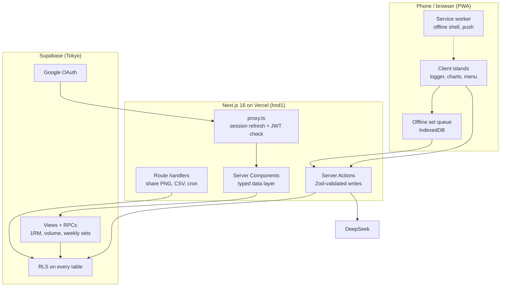

<div align="center">

# 🔥 Fatty

### Train like a Kengan fighter.

A **Kengan Ashura-themed** strength tracker: a fast mobile set logger, programs that run your week, analytics computed in Postgres, and an AI judge who ranks you on a ladder of the series' fighters.

<br />

[](https://hellblazer.vercel.app)
[](https://nextjs.org)
[](https://react.dev)
[](https://www.typescriptlang.org)
[](https://supabase.com)
[](https://tailwindcss.com)

**[Open the app →](https://hellblazer.vercel.app)** · App by [Cyrus](https://kkrwhofrags.xyz)

</div>

---

Fatty is a real, multi-user app, not a demo. Every screen reads live Postgres data behind row-level security, sign-in is Google (plus Sign in with Apple in the iPhone app), and it installs to your phone as a PWA with offline logging and push reminders. Every logged set lands in one atomic `set` table; estimated 1RM, tonnage and weekly sets per muscle are computed in the database, so the phone only ever downloads the numbers it shows.

The twist: your training gets **judged**. An AI judge reads your full history and places you on a ten-rung ladder of Kengan Ashura fighters. You climb it one honest rep at a time.

## Contents

- [Highlights](#highlights)
- [A tour of the app](#a-tour-of-the-app)
- [Logging a workout](#logging-a-workout)
- [The strength ladder](#the-strength-ladder)
- [Design](#design)
- [Performance](#performance)
- [The analytics engine](#the-analytics-engine)
- [Tech stack](#tech-stack)
- [Architecture](#architecture)
- [Data model](#data-model)
- [Security and privacy](#security-and-privacy)
- [PWA, offline and notifications](#pwa-offline-and-notifications)
- [iOS app](#ios-app)
- [Getting started](#getting-started)
- [Testing](#testing)
- [Deployment](#deployment)
- [Project structure](#project-structure)
- [Conventions](#conventions)

## Highlights

- **A set logger built for mid-set use.** Exercises run as a queue. Each one opens in a focused sheet where every new set **copies the last one forward**, and last session's numbers sit above as the target. Thumb-sized steppers, a rest timer, a live workout clock, and autosave that can't create duplicates.
- **It keeps logging offline.** Sets you log without a signal are queued on the device (IndexedDB) and uploaded when you're back. The logger tells you plainly when something hasn't saved yet.
- **Removal: live PR detection.** When a working set beats your all-time best on a lift (heaviest load, or best estimated 1RM), a **Removal** banner drops in, the screen's edge rings in your accent, Android phones buzz, and the set is tagged PR.
- **A victory screen.** Finishing a workout ends on your fighter, a poster-style result word, and your volume, sets, time and records broken.
- **Programs, not just templates.** Load one of five starter programs, or build your own split and run it as a multi-week block. Skip a day, pause and resume, roll back, preview a day before you start it, and swap a movement mid-workout so it becomes that day's default.
- **The strength ladder.** A DeepSeek-powered judge ranks you among ten Kengan fighters, calibrated to your sex, bodyweight, height and age. Its verdict is a reveal you can accept or decline.
- **King of the Hill.** Claim a ring name and you're ranked with everyone else by lifetime volume lifted. The top three stand on a podium as their fighters.
- **A shareable fight card.** Export any session as a 1080×1350 PNG rendered on the server, straight to the share sheet.
- **Analytics from real data.** Weekly sets per muscle, volume trends, a year-long consistency heatmap, per-lift 1RM and volume charts, an all-time 1RM board, muscle balance and volume distribution.
- **Guarded actions.** Slide to finish a workout, hold to delete or wipe, and a 4-second undo on Skip, built from [React Bits](https://reactbits.dev) components (see `src/components/reactbits/README.md`).
- **Six accents.** The whole app re-skins from one colour channel. The palettes are named after the Kengan Association companies: Nogi, Motorhead, Dainippon, Kouou, Under Mount and Gandai.
- **kg or lb.** Weight is always stored in kilograms and converted only for display.

## A tour of the app

| Route | What's there |
|-------|--------------|
| `/` | Landing page and Google sign-in; the ladder's fighters as a swipeable roster. Signed-in visitors go straight to the dashboard. |
| `/welcome` | First-run setup: name, ring name, and the details that calibrate the judge. |
| `/dashboard` | Your rank as a full-bleed fight poster, the **next bout** from your program with Start in thumb reach (Skip comes with an undo), this week against last week, a consistency heatmap, sets per muscle against the 10-20 set range, a 7D / 30D / 1Y volume chart, and recent sessions. |
| `/log` → `/log/[id]` | Start your next programmed day, any other day, or an empty session; then the set logger. |
| `/programs` → `/programs/[id]` | Your programs and the starter programs, each fronted by the fighter whose style it's named after. Pause, resume, roll back, preview, reorder days. |
| `/templates` | The days of your split: exercises, order, target sets, reps and notes. |
| `/exercises` | The 140+ movement library, grouped by muscle, with a how-to for every movement; add your own. |
| `/history` → `/history/[id]` | Every session by month, searchable and filterable. Open one for its stats and sets, to edit it, share it as a card, or delete it. |
| `/progress` | **Lifts:** your top lifts as 12-week estimated-1RM lines with the change, your latest records (each opens its session), then any lift's records, 1RM and volume, and the all-time 1RM board. **Muscles:** your weekly rep-range mix (strength, hypertrophy, endurance), then weekly sets and volume, balance and distribution. Plus your standing on the ladder. |
| `/leaderboard` | King of the Hill: the podium, then everyone else, by total volume. |
| `/settings` | Your profile under your rank fighter; the judge; ring name and details; bodyweight; units and accent; push reminders; CSV export; reset tools. |

On a phone, the five everyday destinations live in a floating glass tab bar. The **•••** in the top bar opens a full-page menu for everything else:
- you, with your fighter and rank;
- the main tabs in large type;
- King of the Hill, Templates, Exercises and History as tiles;
- a Start a workout button.

On desktop a sidebar carries it all.

## Logging a workout

1. **Start.** From the dashboard's next bout, the Log tab, or a program day. The session copies that day's exercises and targets.
2. **Work the queue.** Exercises show as done, up now, or waiting. Start one and it opens in a sheet.
3. **Log sets.** The first set pre-fills from last time; each new set copies the one before. Weight and reps have large steppers, RPE and a warm-up flag are optional, and a rest timer runs between sets.
4. **Adjust freely.** Swap a movement (and keep the swap for next time), add bonus exercises that don't touch your program, or remove one.
5. **Finish.** Slide to finish (a slide, so a stray tap mid-set can't end the workout). The duration fills in from the clock, the victory screen plays, and you land on the session.

Reopen a finished session from History to fix it: it opens in **editing** mode, with no live clock, and saving keeps its original finish time. A session left open by mistake stops counting after 6 hours, so you don't record a day-long workout.

## The strength ladder

Log a workout, then ask to be judged. The judge (DeepSeek) weighs your real numbers, relative to bodyweight on the big lifts and calibrated to your sex, height and age. You start unranked and climb from **Rei** to **Kuroki**.

- **Two regimes.** Ranks 1-4 (Rei → Gaolang) are strict: logged loads only, no rounding up. Clearing the **Gaolang wall** is the achievement. From Julius (5) up, clear progress promotes you and ties round up.
- **Earning a verdict.** You need a finished workout logged since your last verdict, and the judge rules at most once every 5 days. Declining doesn't buy a re-roll: the cooldown starts when the judge speaks.
- **Past the Monster.** Rank above Julius Reinhold and the limits lift: ask for a verdict whenever you like.
- **You choose.** The verdict is stored on the server as pending. Accepting applies exactly that verdict; the client can't name a rank.

| # | Fighter | Call sign | Standard |
|:-:|---------|-----------|----------|
| 10 | **Kuroki Gensai** | The Devil Lance | Once in a generation |
| 9 | **Kanoh Agito** | The Fang of Metsudo | Near the natural ceiling |
| 8 | **Ohma Tokita** | The Ashura | Elite, near-competitive |
| 7 | **Wakatsuki Takeshi** | The Wild Tiger | Near-elite, strong all round |
| 6 | **Raian Kure** | The Devil | Very advanced |
| 5 | **Julius Reinhold** | The Monster | Advanced |
| 4 | **Gaolang Wongsawat** | The Thai God of War | Strong intermediate |
| 3 | **Sen Hatsumi** | The Floating Cloud | Solid intermediate |
| 2 | **Setsuna Kiryu** | The Beautiful Beast | Building a base |
| 1 | **Rei Mikazuchi** | The Lightning God | Where everyone starts |

## Design

**True black, one accent, and the fighters.** The base is quiet and native-feeling, so the logger stays fast to use mid-set. The Kengan theme is spent on the moments that matter:
- who you are (the dashboard and profile heroes);
- breaking a record;
- finishing a workout;
- being judged;
- the standings.

- **Colour.** A `#000` canvas that disappears into an OLED phone, graphite surfaces (`#121214`, `#1c1c1f`), bone text (`#f4f2ee`). The accent goes through a single `--accent-rgb` channel, so each of the six palettes re-skins everything at once. It's reserved for what's live or earned: the workout in progress, starting a workout, a record, your rank. Charts and history stay bone.
- **Type.** One family: **Archivo**, variable on width. The expanded cut (`.font-display`, width 125) carries titles and every number that matters, with tabular figures; the regular width does the reading. UI copy is sentence case. Uppercase and a skewed setting are reserved for poster words (the victory result, **Removal**, a verdict).
- **Surfaces.** Grouped lists and cards without borders or shadows; glass only for chrome that floats over content (the tab bar, top bar, sheets, the menu). The dashboard and profile heroes run edge to edge on a phone, up under the clear top bar.
- **Motion.** It marks something happening and then stops:
  - the rank ladder filling on arrival;
  - a record's banner and edge ring;
  - the victory slam;
  - the loading bar.

  Page changes use React's `<ViewTransition>`: tabs crossfade, detail pages slide, a session's title morphs from the list into its page, and the tab highlight travels to where you went. Everything animates transform and opacity only, nothing loops, and `prefers-reduced-motion` shows final frames.
- **The loader.** Every route loads a competition bar: 25s, 20s, 15s, change plates and collars slide on, and the readout rolls to a true 150 kg. It's zero-JS and paints on the first frame of a navigation.
- **Built for phones.** Tested on Pro Max (the primary target) down to an iPhone SE:
  - safe-area insets everywhere;
  - a 16px input floor so iOS never zooms on focus;
  - thumb-reach placement for the actions that matter;
  - drag-to-dismiss sheets.

## Performance

- **Functions run in Tokyo** (`hnd1`), beside the Supabase database, so a page's queries don't cross an ocean.
- **Auth checks are local.** The proxy verifies the session JWT against the project's ES256 public key (`getClaims()`), instead of calling the Auth server on every navigation.
- **Heavy reads are aggregated in Postgres** (views and RPCs), so there's no pulling every set to the client and no row-cap truncation.
- **Light where it counts.** The dashboard ships no charting library; its bars are HTML. Sheets and the menu are CSS, so no animation library loads on shared routes. Recharts loads only on Progress and Settings.
- **Smooth under load.** Animations are compositor-driven (transform and opacity), so they stay smooth while the next page hydrates.
- **Instant back-and-forth.** The client router cache reuses recently visited pages (`staleTimes`), so switching tabs doesn't refetch.

## The analytics engine

Nothing derived is stored. It's computed from the `set` grain by **security-invoker views** and **RPCs**, so RLS still applies and the client gets pre-aggregated rows.

- **Estimated 1RM (Epley):** `weight × (1 + reps / 30)`, working sets only.
- **Volume:** `Σ weight × reps` over working sets, per session, per exercise and per muscle.
- **Weekly sets per muscle:** working sets by ISO week and primary muscle; each secondary muscle counts **0.5×**, so accessory work is credited honestly.
- **Records:** heaviest weight, best estimated 1RM and best single-set volume per lift.
- **Local dates:** sessions are dated in the lifter's own timezone, not the database's UTC, so a late-night workout lands on the right day.

| Object | Kind | Used for |
|--------|------|----------|
| `v_working_set` | view | Completed, non-warm-up sets with muscle and 1RM |
| `v_session_summary` | view | Per-session volume, sets, duration, finish state |
| `v_exercise_progression` | view | Best estimated 1RM per session, per lift |
| `v_weekly_sets_per_muscle` | view | Sets and volume per muscle per ISO week |
| `exercise_stats(p_exclude_session)` | RPC | Per-lift records and progress, in one round trip |
| `last_performances(p_exercise_ids, p_exclude_session)` | RPC | "Last time" targets in the logger |
| `leaderboard()` | RPC | King of the Hill: ring name, rank and total volume only |
| `rep_range_weekly(p_since)` | RPC | Working sets per week in 1-5, 6-12 and 13+ rep ranges |
| `recent_records(p_limit)` | RPC | Personal records as events: what was beaten, when, by how much |

## Tech stack

| Layer | Choice |
|-------|--------|
| Framework | **Next.js 16** (App Router, Server Components, Server Actions, `proxy.ts`) |
| UI | **React 19** (incl. `<ViewTransition>`), **Tailwind CSS v4** (CSS-first `@theme` tokens) |
| Language | **TypeScript 6** |
| Backend | **Supabase**: Postgres, row-level security, views and RPCs, Google OAuth, Realtime |
| Auth | `@supabase/ssr`: cookie sessions, JWT verified in the proxy |
| Validation | **Zod 4** on every Server Action |
| Charts | **Recharts 3** (Progress and Settings only); HTML bars elsewhere |
| Motion | CSS first; `motion` only for the logger's counting figures and the welcome stepper |
| AI judge | **DeepSeek** (`deepseek-v4-flash`), optional |
| Push | **web-push** (VAPID) and a hand-written service worker |
| Tests | **Vitest** |
| Primitives | `class-variance-authority`, `clsx`, `tailwind-merge`, `lucide-react`, `date-fns` |

There's no Redux, no tRPC and no component library: Server Components, Supabase, and a small set of hand-built primitives.

## Architecture



- **Reads** go through a typed data layer (`src/lib/data/*`), not raw Supabase calls in components.
- **Writes** are Server Actions (`src/lib/actions/*`), each validated with Zod and scoped by RLS.
- **Sessions** are refreshed and checked in `src/proxy.ts` (Next 16's replacement for middleware); pages read the verified identity from the cookie.
- **Types** are generated from the live schema into `src/lib/database.types.ts`.
- **Realtime** keeps open tabs in sync when you log from another device.

## Data model

Template-based with ad-hoc override: build reusable days, run them as programs, log freely on top. Every source writes to the same `set` grain.

```
exercise            140+ global movements (user_id null) + your custom ones
workout_template ── template_exercise        a day of your split, with targets
program ─────────── program_day, program_skip   multi-week rotation, skips, pauses
session ─────────── session_exercise ── set     what you actually did
bodyweight_log      dated bodyweight entries
profile             name, ring name, sex, birth year, height, rank + reasoning,
                    pending verdict, reminder hour, onboarding
push_subscription   Web Push endpoints per device
```

**Muscle groups** (`muscle_group` enum, 14): chest, back, side delts, rear delts, front delts, biceps, triceps, quads, hamstrings, glutes, calves, abs, forearms and traps.

Unit, accent and timezone preferences are cookies, read on the server so the first paint is already in your units and colours.

## Security and privacy

- **RLS on every table.** Every user-owned row carries `user_id`, and policies limit access to `auth.uid()`. A second account sees none of the first account's data. The exercise library is the one shared, read-only table.
- **Rank can't be self-assigned.** The rank columns are not writable by the signed-in user at all (column-level grants); the judge's verdict is written server-side as pending and applied by a service-role client only when you accept it.
- **The leaderboard exposes only public columns** (ring name, rank, volume) through a `security definer` function that requires a signed-in caller.
- **Google OAuth only**: no passwords and no magic links.
- **No secrets in the browser.** Only the Supabase URL and anon key reach the client. The service-role key, VAPID private key, DeepSeek key and cron secret stay on the server.
- **Headers.** Every response carries `X-Content-Type-Options`, `Referrer-Policy`, `X-Frame-Options: DENY` and a restrictive `Permissions-Policy`.

## PWA, offline and notifications

- **Installable.** Standalone display, maskable icons, and **iOS launch screens** for current iPhones (`scripts/generate-splash.mjs`), so a cold start shows the brand instead of a white flash. A boot screen holds that frame until the app is ready (installed app only).
- **Offline.** A hand-written service worker (`public/sw.js`): network-first pages with an offline fallback (`public/offline.html`), cached media. It never caches Next's own scripts and styles, so a deploy can't pair new HTML with old code.
- **Offline logging.** Sets go to an IndexedDB queue first and upload when there's a connection; failures are shown, retried, and never silently dropped.
- **Push reminders.** Web Push (VAPID) and a **daily cron** (`/api/cron/reminders`) that nudges you when today's programmed workout isn't done. On iPhone, push works once the app is added to the Home Screen (iOS 16.4+).

## iOS app

A native iPhone app built with **Capacitor**. It's a thin shell around the live site: the app loads `https://hellblazer.vercel.app` in a WKWebView, so every web deploy updates the app too. Only native changes need a new build.

- **What's native.**
  - **Sign-in:** Google through Google's iOS SDK (Google blocks OAuth inside web views) and Sign in with Apple, listed first in the app. Each returns an ID token with a hashed nonce, and `POST /auth/native` swaps it for the same Supabase session cookies the website's redirect flow sets. Apple's refresh token is kept server-side (`apple_token`) only so it can be revoked on account deletion.
  - **Linking:** Settings → Sign-in methods connects the other provider to the same account (`linkIdentity`: Google by redirect on the web or natively in the app, Apple in the app), so either signs you in. Needs Supabase's *Allow manual linking*.
  - **Rest timer:** a Live Activity on the Lock Screen and in the Dynamic Island, drawn by the system from the end time, plus a "Rest's up" alert for a locked phone.
  - **Widgets:** "Next Bout" for the Home Screen (small, medium) and Lock Screen (rectangular, circular, inline). The dashboard writes a snapshot into the App Group; the widget resets when the week rolls over.
  - **Apple Health:** with the switch on in Settings, finished sessions are saved as strength-training workouts and logged bodyweight as body mass. Nothing is read from Health.
  - **Push:** APNs (`src/lib/apns.ts`) beside Web Push; the daily reminder cron sends to both. Tapping a notification opens its page.
  - **Siri, Spotlight and Shortcuts** (App Intents), **Home Screen quick actions**, and **universal links** (`/.well-known/apple-app-site-association`) all land on the right page through `NativeRouter`.
  - Taptic Engine haptics for records and the end of a rest (`src/lib/haptics.ts`); a true-black launch screen with the flame; dark system UI.
- **The native code:** `ios/App/App` (the app's plugin `HellBlazerNativePlugin`, the router, App Intents), `ios/App/Widgets` (the widget extension), `ios/App/Shared` (types both targets compile). `scripts/ios-configure-project.rb` edits the Xcode project without Xcode.
- **Web and PWA are untouched.** Everything app-only sits behind `isNativeApp()` (`src/lib/native.ts`), and plugin code loads through dynamic imports inside that check, so the website never downloads it.
- **Offline.** App-Bound Domains are on, which lets the service worker run in the app, and `app-shell/offline.html` covers a first launch with no signal.
- **Builds without Xcode.** `.github/workflows/ios.yml` builds on a GitHub-hosted Mac whenever `ios/`, `app-shell/` or `capacitor.config.ts` changes, or by hand from the Actions tab.
  - Before signing is set up, it only checks that the app compiles.
  - After `node scripts/ios-signing-setup.mjs --key AuthKey_XXXX.p8 --issuer <id>`, it signs both targets with fastlane (`ios/fastlane/Fastfile`) and uploads to TestFlight. That script registers both bundle IDs and their capabilities, creates the distribution certificate and stores everything as GitHub secrets.
- **Changing the icon or launch mark:** `node scripts/generate-ios-assets.mjs`.
- **After adding or removing a Capacitor plugin:** run `npx cap sync ios` and commit `ios/`.

## Getting started

**You'll need:** Node 20+, a Supabase project with the Google provider enabled, and, optionally, a DeepSeek API key and a VAPID key pair.

```bash
npm install
# create .env.local with the variables below
npm run dev      # http://localhost:3000
```

**Environment variables**

| Variable | Required | Purpose |
|----------|:--------:|---------|
| `NEXT_PUBLIC_SUPABASE_URL` | ✅ | Supabase project URL |
| `NEXT_PUBLIC_SUPABASE_ANON_KEY` | ✅ | Public anon key (safe in the browser) |
| `SUPABASE_SERVICE_ROLE_KEY` | for rank + cron | Server only. Applies accepted verdicts and runs the reminder cron |
| `DEEPSEEK_API_KEY` | optional | Turns on the strength judge |
| `NEXT_PUBLIC_VAPID_PUBLIC_KEY` | optional | Web Push public key |
| `VAPID_PRIVATE_KEY` | optional | Web Push private key (server only) |
| `VAPID_SUBJECT` | optional | Contact for push services, e.g. `mailto:you@example.com` |
| `CRON_SECRET` | optional | Authorizes `/api/cron/reminders` |
| `APPLE_TEAM_ID` | for iOS | Apple team ID: universal links, APNs, Sign in with Apple |
| `APPLE_KEY_ID` | for iOS | ID of the Apple server key (APNs + Sign in with Apple) |
| `APPLE_PRIVATE_KEY` | for iOS | That key's `.p8` contents (server only) |

Generate a VAPID pair with `npx web-push generate-vapid-keys`.

**Supabase setup**

1. Enable the **Google** provider and add `<your-site>/auth/callback` (and `http://localhost:3000/auth/callback`) to the allowed redirect URLs.
2. The schema (tables, enum, RLS policies, views, RPCs and column grants) is managed as migrations applied to the Supabase project itself; this repository doesn't carry a migrations folder. To stand up your own copy, dump the schema from an existing project (`supabase db dump --schema public`) and apply it. `src/lib/database.types.ts` documents every table, view and function.
3. Seed the global exercise library. The one-off scripts in `scripts/sql/` add common movements and remove duplicates.
4. After schema changes, regenerate types into `src/lib/database.types.ts` (`supabase gen types typescript`).

**Scripts**

```bash
npm run dev      # dev server
npm run build    # production build
npm run start    # serve the production build
npm run lint     # ESLint
npm test         # Vitest
node scripts/generate-splash.mjs   # regenerate iOS launch screens
```

## Testing

`npm test` runs the Vitest suite, which covers the parts that are easy to get subtly wrong:

- **`local-date`:** dating sessions in the lifter's timezone.
- **`offline-set-queue`:** the IndexedDB queue (on `fake-indexeddb`): sessions kept apart, the latest edit winning, uploads clearing entries without losing an edit made mid-upload, and deletes.
- **`rest-timer`:** the rest timer's arithmetic.

Before shipping, `npx tsc --noEmit`, `npm run lint` and `npm run build` should all pass clean.

## Deployment

The app deploys on **Vercel**, and a push to `main` is a production deploy.

- Functions are pinned to `hnd1` (Tokyo) in `vercel.json`, next to the Supabase region.
- The reminder cron runs daily (`0 16 * * *`), which is the Hobby plan's limit. Hourly, per-user reminder times would need Pro.
- Set the environment variables above in the Vercel project (server-only keys in Production and Preview).

## Project structure

```
src/
├── app/
│   ├── (app)/                 signed-in routes: dashboard, log, programs, templates,
│   │                          exercises, history, progress, leaderboard, settings
│   │   ├── layout.tsx         the app shell: nav, resume banner, page transitions
│   │   ├── loading.tsx        the loading bar (one per route)
│   │   └── error.tsx          recoverable error screen
│   ├── api/
│   │   ├── share/[id]/        session → 1080×1350 PNG (next/og)
│   │   ├── export/            your set log as CSV
│   │   └── cron/reminders/    daily push reminders
│   ├── auth/callback/         OAuth callback
│   ├── auth/native/           ID-token sign-in for the iOS app
│   ├── welcome/               first-run setup
│   ├── page.tsx               landing and sign-in
│   ├── layout.tsx             root: font, accent, iOS launch screens, boot screen
│   ├── error.tsx, global-error.tsx, not-found.tsx
│   ├── manifest.ts, robots.ts
│   └── globals.css            tokens, palettes, glass, motion
├── components/
│   ├── nav/                   tab bar, sidebar, top bar, full-page menu, page transitions
│   ├── ui/                    primitives: Button, Sheet, NumberStepper, PlateLoader, …
│   ├── tier/                  fighter art, rank hero, profile header, ladder
│   ├── charts/                HTML bar charts, Recharts views, heatmap
│   ├── program/               next-bout card, starter programs, day preview
│   └── workout/               rest timer, victory screen
├── lib/
│   ├── data/                  typed reads, per entity
│   ├── actions/               Zod-validated Server Actions
│   ├── supabase/              server, browser, proxy and service-role clients
│   ├── tiers.ts               the ladder
│   ├── presets.ts             starter programs
│   ├── exercise-guides.ts     a how-to for every library movement
│   ├── offline-set-queue.ts   IndexedDB queue for offline logging
│   └── database.types.ts      generated from the live schema
└── proxy.ts                   session refresh and route gate

public/     sw.js, offline.html, splash/, art/fighters/
scripts/    generate-splash.mjs, generate-ios-assets.mjs, ios-signing-setup.mjs, sql/
ios/        the Capacitor Xcode project and fastlane lane
app-shell/  files bundled into the iOS app (offline page)
```

## Conventions

- **Data flows one way.** Reads live in `src/lib/data`; writes are Server Actions in `src/lib/actions`, validated with Zod. No Supabase calls in components.
- **Kilograms everywhere.** Convert only at display (`src/lib/units.ts`).
- **Dates in the lifter's timezone.** Format dates on the server (or pass `today` down). Formatting in a client component during render disagrees with the server and breaks hydration.
- **Global CSS goes in a layer.** Tailwind v4 utilities live in `@layer utilities`, and any unlayered rule in `globals.css` beats them all regardless of specificity. Element defaults go in `@layer base`.
- **Motion carries meaning.** Animate transform and opacity only, don't loop, respect reduced motion, and no tap or cursor effects.
- **Keep heavy libraries off shared paths.** Anything imported by the nav or the dashboard loads for everyone.

---

<div align="center">

**[Fatty](https://hellblazer.vercel.app)**, built by [Cyrus](https://kkrwhofrags.xyz)

*Numbers don't lie. Make them climb.*

</div>
